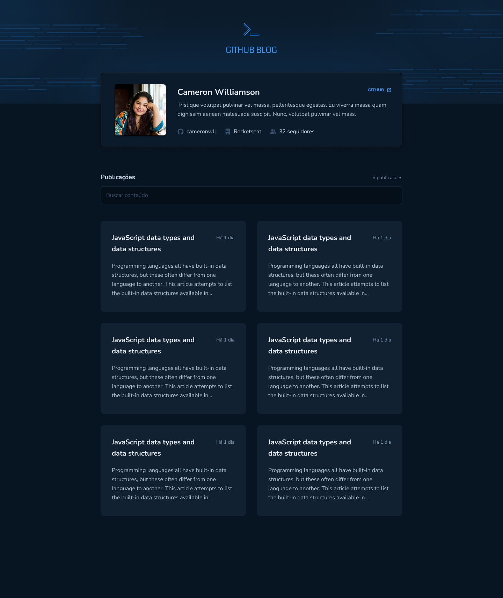
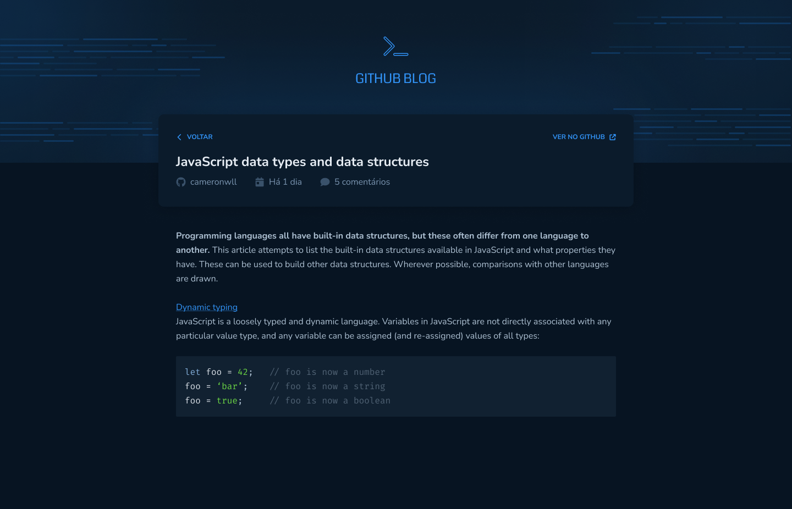

### 🔗 Link para o projeto online

[Link da aplicação online](https://ignite-github-blog-blush.vercel.app/)

<h1 align="center">
    
</h1>

  <a href="#rocket-tecnologias">Tecnologias</a>&nbsp;&nbsp;&nbsp;|&nbsp;&nbsp;&nbsp;
  <a href="#-projeto">Projeto</a>&nbsp;&nbsp;&nbsp;|&nbsp;&nbsp;&nbsp;
  <a href="#-layout">Layout</a>&nbsp;&nbsp;&nbsp;|&nbsp;&nbsp;&nbsp;
  <a href="#-como-contribuir">Como contribuir</a>&nbsp;&nbsp;&nbsp;

 

  
  

## 🚀 Tecnologias

Esse projeto foi desenvolvido com as seguintes tecnologias:

- [vite](https://vitejs.dev/)
- [React](https://reactjs.org)
- [react-router-dom](https://v5.reactrouter.com/web/guides/quick-start)
- [react-markdown](https://github.com/remarkjs/react-markdown)
- [react-hook-form](https://react-hook-form.com/)
- [react-syntax-highlighter](https://react-syntax-highlighter.github.io/react-syntax-highlighter/demo/)
- [styled-components](https://styled-components.com/)
- [fontawesome](https://fontawesome.com/)
- [axios](https://axios-http.com/ptbr/docs/intro)
- [moment](https://momentjs.com/)
- [zod](https://github.com/colinhacks/zod)

## 💻 Projeto

O Github Blog e um projeto baseado no desafio da rocketseat, trilha ReactJS do ignite, Chapter 03 de 2022, onde recebendo a base do layout pelo Figma e desenvolvemos.

[Documentação do Desafio](https://efficient-sloth-d85.notion.site/Desafio-03-Github-Blog-13593953670346908462ddc648d42cf1)

## 🔖 Layout

Você pode visualizar o layout do projeto através [desse link](<https://www.figma.com/file/4SmVLAR0TWNIDeLLLS5bVG/GitHub-Blog-(Community)>). Lembrando que você precisa ter uma conta no [Figma](http://figma.com/) para acessá-lo.

## 🤔 Como contribuir

- Faça um fork desse repositório;
- Cria uma branch com a sua feature: `git checkout -b minha-feature`;
- Faça commit das suas alterações: `git commit -m 'feat: Minha nova feature'`;
- Faça push para a sua branch: `git push origin minha-feature`.

Depois que o merge da sua pull request for feito, você pode deletar a sua branch.

---

Feito com ♥ by Hugo Alves Varella
